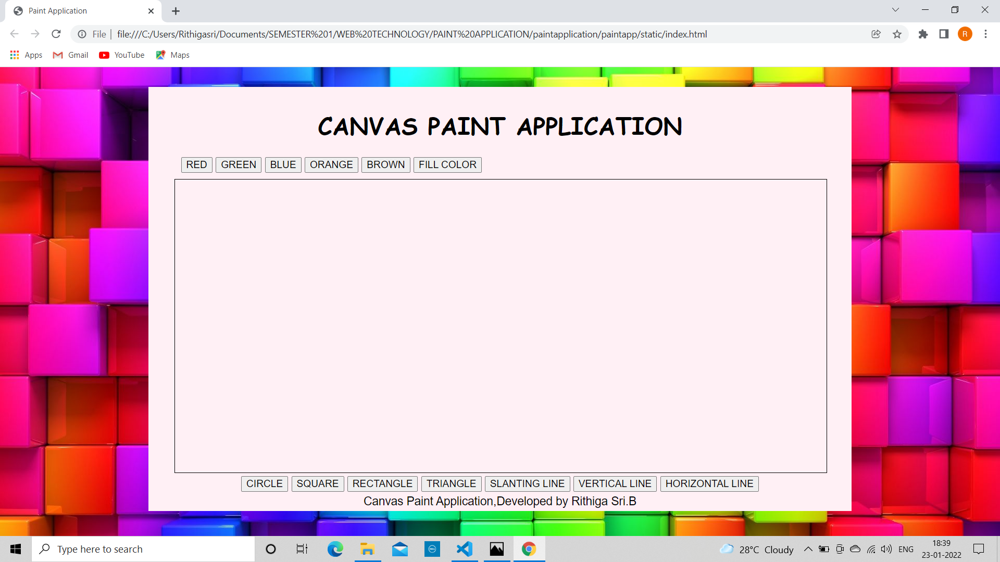
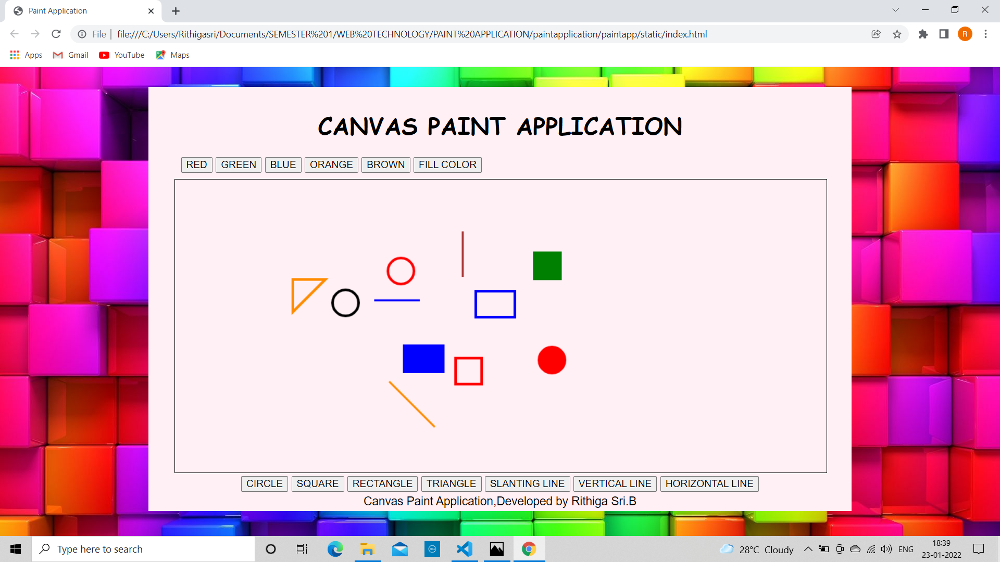

# Web Page for Paint Application

## AIM:

To design a static website for Paint Application using HTML5 canvas.

## DESIGN STEPS:

### Step 1:

Requirement collection.

### Step 2:

Creating the layout using HTML,CSS and canvas.

### Step 3:

Write javascript to capture move events.

### Step 4:

Perform the drawing operation based on the user input.

### Step 5:

Validate the layout in various browsers.

### Step 6:

Validate the HTML code.

### Step 6:

Publish the website in the given URL.

## PROGRAM :

```
<!DOCTYPE html>
<html lang="en">
  <head>
    <meta charset="UTF-8" />
    <meta http-equiv="X-UA-Compatible" content="IE=edge" />
    <meta name="viewport" content="width=device-width, initial-scale=1.0" />
    <title>Paint Application</title>
    <style>
      * {
        box-sizing: border-box;
        font-family: Arial, Helvetica, sans-serif;
      }
      body {
        background-image: url("https://colors.dopely.top/inside-colors/wp-content/uploads/2021/06/colorful-backgrounds-11.jpg");
        background-size:cover;
        
      }
      .container {
        width: 1080px;
        margin-left: auto;
        margin-right: auto;
        
      }
      .content {
        display: block;
        width: 100%;
        background-color:lavenderblush;
        min-height: 650px;
        margin: 30px 50px 0px 0px;
        padding-top: 10px;
      }
      h1 {
      
        text-align: center;
        font-family: cursive;
      }
      canvas {
        margin-left: 40px;
        margin-right: 40px;
      }
      .toolbar {
        text-align: center;
    
      }
      .toolbar1 {
        text-align: left;
        margin-left:50px;
        margin-bottom:10px;
      }
      .footer{
        display:block;
        width:100%;
        height: 30px;
        color:black;
        text-align: center;
        padding-top: 5px;
        margin: 0px 0px 0px 0px;

    
}
    </style>
    <script>
      var shape;
      var color;
      var fill;
      function myClickEvent(e){
        var message;
        //message="X="+e.offsetX+",Y="+e.offsetY;
        
        ctx.beginPath();
        if(shape==0){
          ctx.arc(e.offsetX,e.offsetY,20,0,2 * Math.PI);
          ctx.lineWidth=4;
          
        }if(shape==1){
          ctx.rect(e.offsetX, e.offsetY, 40,40);
          ctx.lineWidth=4;
        }if(shape==2){
          ctx.rect(e.offsetX,e.offsetY,60,40);
          ctx.lineWidth=4;
        }if(shape==3){
          ctx.moveTo(e.offsetX,e.offsetY);
          ctx.lineTo(e.offsetX+50,e.offsetY);
          ctx.lineTo(e.offsetX,e.offsetY+50);
          ctx.lineTo(e.offsetX,e.offsetY);
          ctx.lineTo(e.offsetX+50,e.offsetY);
          ctx.lineWidth=4;
        }if(shape==4){
          ctx.moveTo(e.offsetX,e.offsetY);
          ctx.lineTo(e.offsetX+70,e.offsetY+70);
          ctx.lineWidth=3;
        }if(shape==5){
          ctx.moveTo(e.offsetX,e.offsetY);
          ctx.lineTo(e.offsetX,e.offsetY+70);
          ctx.lineWidth=3;
        }else if(shape==6){
          ctx.moveTo(e.offsetX,e.offsetY);
          ctx.lineTo(e.offsetX+70,e.offsetY);
          ctx.lineWidth=3;
        }

        if(color==1){
          ctx.strokeStyle="#FF0000";
          if (fill==1) {
            ctx.fillStyle="#FF0000";
            ctx.fill();
          } 
                   
        
        }if(color==2){
          ctx.strokeStyle="#008000";
          if(fill==1){
            ctx.fillStyle="#008000";
            ctx.fill();
          }
        }if(color==3){
          ctx.strokeStyle="#0000FF";
          if(fill==1){
            ctx.fillStyle="#0000FF";
            ctx.fill();
          }
        }if(color==4){
          ctx.strokeStyle="#FF8C00";
          if(fill==1){
            ctx.fillStyle="#FF8C00";
            ctx.fill();
          }
        }else if(color==5){
          ctx.strokeStyle="#A52A2A";
          if(fill==1){
            ctx.fillStyle="#A52A2A";
            ctx.fill();
          }
        }


        
        ctx.stroke();  
      }
      function circleClicked(){
        shape=0;
      }
      function squareClicked(){
        shape=1;
      }
      function rectangleClicked(){
        shape=2;
      }
      function triangleClicked(){
        shape=3;
      }
      function slineClicked(){
        shape=4;
      }
      function vlineClicked(){
        shape=5;
      }
      function hlineClicked(){
        shape=6;
      }
      function redClicked(){
        color=1;
      }
      function greenClicked(){
        color=2;
      }
      function blueClicked(){
        color=3;
      }
      function orangeClicked(){
        color=4;
      }
      function brownClicked(){
        color=5;
      }
      function colorClicked(){
        fill=1;
      }
      
    </script>
  </head>
  <body>
    <div class="container">
      <div class="content">
        <h1>CANVAS PAINT APPLICATION</h1>
        <div>
          <div class="toolbar1">
            <input type="button" id="red" value="RED">
            <input type="button" id="green" value="GREEN"/>
            <input type="button" id="blue" value="BLUE"/>
            <input type="button" id="orange" value="ORANGE"/>
            <input type="button" id="brown" value="BROWN"/>
            <input type="button" id="fill" value="FILL COLOR" />
            
          </div>
          
        </div>

          <canvas
            id="myCanvas"
            width="1000"
            height="450"
            style="border: 1px solid #000000">
          
      </canvas>
      <div class="toolbar">
        <input type="button" id="circle" value="CIRCLE"/>
        <input type="button" id="square" value="SQUARE"/>
        <input type="button" id="rectangle" value="RECTANGLE"/>
        <input type="button" id="triangle" value="TRIANGLE"/>
        <input type="button" id="sline" value="SLANTING LINE"/>
        <input type="button" id="vline" value="VERTICAL LINE"/>
        <input type="button" id="hline" value="HORIZONTAL LINE"/>
        
      </div>
      <div class="footer">Canvas Paint Application,Developed by Rithiga Sri.B</div>
      </div>
    </div>
    <script>
      var c=document.getElementById("myCanvas");
      var ctx=c.getContext("2d");
      c.addEventListener("click", myClickEvent);
      document
        .getElementById("circle")
        .addEventListener("click", circleClicked);
      document
        .getElementById("square")
        .addEventListener("click", squareClicked);
      document
        .getElementById("rectangle")
        .addEventListener("click", rectangleClicked);
      document
        .getElementById("triangle")
        .addEventListener("click", triangleClicked);
      document
        .getElementById("sline")
        .addEventListener("click", slineClicked);
      document
        .getElementById("vline")
        .addEventListener("click", vlineClicked);
      document
        .getElementById("hline")
        .addEventListener("click", hlineClicked);
      document
        .getElementById("red")
        .addEventListener("click", redClicked);
      document
        .getElementById("green")
        .addEventListener("click", greenClicked);  
      document
        .getElementById("blue")
        .addEventListener("click", blueClicked); 
      document
        .getElementById("brown")
        .addEventListener("click", brownClicked);
      document
        .getElementById("orange")
        .addEventListener("click", orangeClicked);
      document
        .getElementById("fill")
        .addEventListener("click",colorClicked); 
    </script>
  </body>
</html>


```

## OUTPUT:


## SAMPLE OUTPUT:


## VALIDATION REPORT:


## Result:

Thus a website is designed and validated for paint application using HTML5 canvas.
